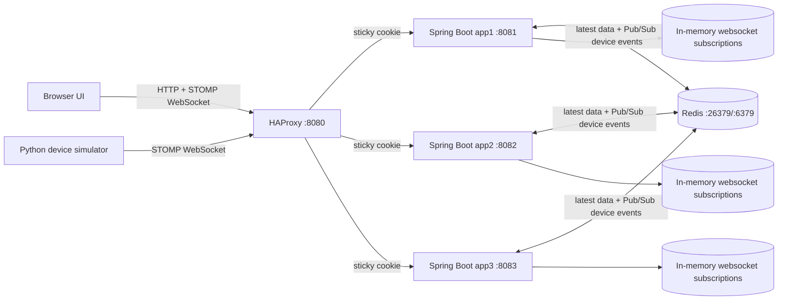
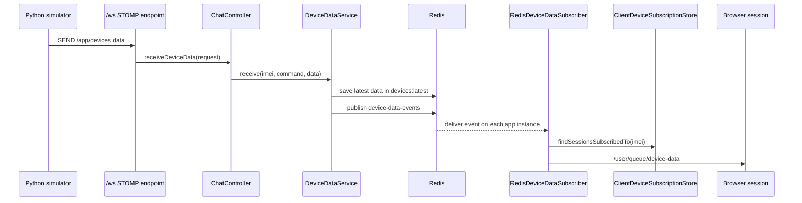
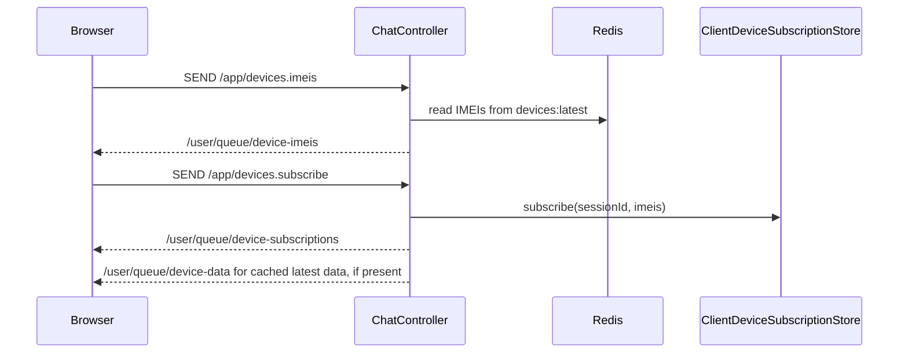

# Multi Spring Boot WebSocket Demo - Project Documentation

## Table Of Contents

- [Overview](#overview)
- [Quick Start](#quick-start)
- [Tech Stack](#tech-stack)
- [Runtime Topology](#runtime-topology)
- [Source Layout](#source-layout)
- [Backend Application](#backend-application)
- [Device Data Flow](#device-data-flow)
- [Web UI](#web-ui)
- [Python Device Simulator](#python-device-simulator)
- [Local Cluster Operations](#local-cluster-operations)
- [Build And Test](#build-and-test)
- [Configuration](#configuration)
- [Docker Compose Services](#docker-compose-services)
- [HAProxy Configuration](#haproxy-configuration)
- [Current Limitations](#current-limitations)
- [Common Troubleshooting](#common-troubleshooting)
- [Development Notes](#development-notes)

## Overview

This project is a local multi-instance Spring Boot WebSocket/STOMP demo for streaming simulated device data to browser clients.

The main use case is:

1. A browser opens the static UI served by Spring Boot.
2. The browser connects to the STOMP websocket endpoint.
3. A Python simulator generates fake device telemetry and uploads it over STOMP.
4. Spring Boot stores the latest payload for each device IMEI in Redis.
5. Spring Boot publishes a Redis pub/sub event for the device update.
6. Each app instance receives the Redis event and pushes matching updates to its own connected browser sessions.

The project also includes a local HAProxy setup that runs three Spring Boot instances behind one front door. HAProxy uses sticky cookies so each browser stays on the same backend instance for its websocket session. Latest device data is shared through Redis, while active websocket sessions and selected IMEI subscriptions still live inside each Spring Boot process.

## Quick Start

From the project root, start the full local cluster:

```bash
cd /home/pavel/projects/test/multi
make start
```

Open the browser UI:

```text
http://localhost:8080
```

In another terminal, start the Python simulator:

```bash
cd /home/pavel/projects/test/multi/sim-device
python3 -m venv .venv
.venv/bin/python -m pip install -r requirements.txt
.venv/bin/python main.py 10 1000XXXXX
```

Then use the UI:

1. Click `Connect to Server`.
2. Click `Get All Devices`.
3. Select one or more IMEIs.
4. Click `Subscribe Selected Devices`.
5. Watch live data appear in the subscribed device data panel.

Stop the cluster when finished:

```bash
cd /home/pavel/projects/test/multi
make stop
```

## Tech Stack

| Area | Technology |
| --- | --- |
| Backend | Java 25, Spring Boot 4.1.1 |
| WebSocket protocol | STOMP over WebSocket |
| Spring modules | `spring-boot-starter-websocket`, `spring-boot-starter-validation`, `spring-boot-starter-data-redis` |
| Shared state / events | Redis hash for latest device data, Redis pub/sub for device update events |
| JSON mapping | Jackson 3 `tools.jackson` packages |
| Fake data | `net.datafaker:datafaker` on Java side, Python `random` in the active simulator |
| Frontend | Static HTML, CSS, browser JavaScript, `@stomp/stompjs` from CDN |
| Python simulator | Python 3, `websocket-client` |
| Local Docker services | Docker Compose, HAProxy 3.0 Alpine, Redis 7 Alpine |
| Build | Maven / Maven Wrapper, Makefile |

## Runtime Topology

Local cluster layout:

| Component | URL |
| --- | --- |
| HAProxy front door | `http://localhost:8080` |
| Spring Boot `app1` | `http://localhost:8081` |
| Spring Boot `app2` | `http://localhost:8082` |
| Spring Boot `app3` | `http://localhost:8083` |
| Redis | `localhost:26379` on host, `6379` in the container |



Important behavior:

- Latest device data is stored in a shared Redis hash.
- Device updates are broadcast to all app instances through Redis pub/sub.
- Each Spring Boot instance has its own in-memory websocket subscription store.
- There is no shared websocket session store; websocket connections remain owned by the app instance that accepted them.
- There is no external STOMP broker; Spring's simple in-memory STOMP broker is still used inside each app instance.
- HAProxy sticky routing keeps one client on one backend after it receives an `APP_INSTANCE` cookie.
- The browser and Python simulator can land on different backend instances and still share device data through Redis.

For debugging one backend directly, point the browser at `http://localhost:8081` and the simulator at `DEVICE_SOCKET_URL=ws://localhost:8081/ws`.

## Source Layout

Paths in this document are relative to the project root unless stated otherwise.

| Path | Purpose |
| --- | --- |
| `pom.xml` | Maven project definition, Java version, Spring Boot, Redis, Jackson, and plugin dependencies |
| `Makefile` | Common local commands for build, test, cluster control, logs, Docker Compose, and HAProxy checks |
| `src/main/java/com/irinfosys/websocket/multi` | Spring Boot application source |
| `src/main/resources/application.yaml` | Runtime defaults for server port, instance id, Redis, and simulator interval |
| `src/main/resources/static` | Browser UI served by Spring Boot |
| `sim-device` | Python STOMP client and fake device simulator |
| `scripts/start-local-cluster.sh` | Builds the jar, starts Redis, starts three app instances, starts HAProxy, verifies sticky routing |
| `scripts/stop-local-cluster.sh` | Stops Docker Compose services and managed Spring Boot instance processes |
| `compose.local-proxy.yml` | Docker Compose file for HAProxy and Redis |
| `ops/haproxy/local-multi-instance.cfg` | HAProxy frontend/backend and sticky cookie configuration |
| `src/test/java/.../MultiApplicationTests.java` | Minimal Spring context load test |
| `README.md` | Quickstart documentation |
| `HELP.md` | Generated Spring Boot helper documentation |

## Backend Application

### Application Entry Point

`MultiApplication` is the Spring Boot entry point. It enables scheduling with `@EnableScheduling`, although the included Java-side scheduled device upload method is currently commented out.

### WebSocket Configuration

`WebSocketConfig` enables Spring's STOMP websocket message broker.

| Setting | Value | Meaning |
| --- | --- | --- |
| WebSocket endpoint | `/ws` | Raw WebSocket endpoint used by browser and Python STOMP clients |
| Allowed origins | `*` | Allows local/browser clients from any origin |
| Application prefix | `/app` | STOMP messages sent here are routed to `@MessageMapping` handlers |
| Simple broker prefixes | `/topic`, `/queue` | In-memory broker destinations for subscribed clients |

This project does not use SockJS. The browser uses `StompJs.Client` with a direct websocket URL, and the Python simulator manually sends STOMP frames over `websocket-client`.

### REST Endpoint

`InstanceController` exposes:

| Method | Path | Response | Purpose |
| --- | --- | --- | --- |
| `GET` | `/api/instance` | `{ "instanceId": "...", "port": "..." }` | Identifies the backend instance handling the request |

This endpoint is used by:

- the browser UI to display the connected Java instance,
- HAProxy health checks,
- local sticky routing checks,
- the Python simulator before opening its websocket connection.

### STOMP Application Destinations

The backend accepts these STOMP application destinations:

| Destination | Handler | Purpose |
| --- | --- | --- |
| `/app/devices.imeis` | `ChatController.getAllImei` | Returns the known device IMEIs from Redis |
| `/app/devices.subscribe` | `ChatController.subscribeDeviceImeis` | Saves the current websocket session's selected IMEIs |
| `/app/devices.data` | `ChatController.receiveDeviceData` | Receives uploaded device data from the simulator |
| `/app/chat.send` | `ChatController.sendMessage` | Broadcasts a simple chat message to `/topic/messages` |

### Outbound STOMP Destinations

| Destination | Audience | Purpose |
| --- | --- | --- |
| `/user/queue/device-imeis` | Current websocket user/session | Device IMEI list response |
| `/user/queue/device-subscriptions` | Current websocket user/session | Confirmation of saved device subscriptions |
| `/user/queue/device-data` | Subscribed sessions | Live latest data for selected IMEIs |
| `/topic/messages` | All topic subscribers | Chat message broadcast |

### Backend Services

| Class | Responsibility |
| --- | --- |
| `RedisDeviceDataConfig` | Declares the Redis pub/sub topic and registers the message listener container |
| `DeviceDataService` | Creates `DeviceLatestData`, saves it to Redis, and publishes a Redis device update event |
| `DeviceLatestDataStore` | Stores and reads latest device data in a Redis hash keyed by IMEI |
| `RedisDeviceDataSubscriber` | Receives Redis device update events and pushes them to matching local websocket sessions |
| `ClientDeviceSubscriptionStore` | Thread-safe in-memory map of websocket session id to selected IMEIs |
| `WebSocketPublisher` | Wrapper around `SimpMessagingTemplate` for topic, user, and session-targeted publishing |
| `DeviceDataSimulator` | Java-side fake data generator; scheduled method is currently commented out |

### Redis Data And Events

Redis is used for two separate jobs:

| Redis use | Name | Purpose |
| --- | --- | --- |
| Hash | `devices:latest` | Stores one JSON `DeviceLatestData` value per IMEI |
| Pub/sub channel | `device-data-events` | Broadcasts each new device update to every running Spring Boot instance |

The websocket subscription store remains local to each app process. This is intentional because websocket sessions cannot be moved into Redis; each app can only send messages to sessions connected to that same app.

Redis must be available before the Spring Boot context finishes starting because the `RedisMessageListenerContainer` subscribes to `device-data-events` during startup. The local cluster script starts the project Redis service first, waits for `PONG`, and only then launches the Java instances.

### Data Models

| Type | Shape |
| --- | --- |
| `DeviceDataUploadRequest` | `imei`, optional `command`, non-null `data` map |
| `DeviceLatestData` | `imei`, `command`, `data`, server-side `receivedAt` timestamp |
| `DeviceSubscriptionRequest` | list of `imeis` |
| `DeviceSubscriptionResponse` | `sessionId`, list of saved `imeis` |
| `ChatMessage` | `sender`, `content`, `sentAt` |
| `DeviceInfo` | helper object for simulator IMEI and upload interval timing |

## Device Data Flow

### Upload Flow



### Browser Subscription Flow



## Web UI

The browser UI is served from `src/main/resources/static`.

| File | Role |
| --- | --- |
| `index.html` | Markup for connection controls, IMEI selection, and output panels |
| `app.js` | STOMP connection, subscriptions, publish calls, and UI state changes |
| `styles.css` | Basic layout and panel styling |

UI workflow:

1. Open `http://localhost:8080` for the HAProxy front door, or a direct backend such as `http://localhost:8081`.
2. Click `Connect to Server`.
3. The UI connects to `/ws` using `ws://` or `wss://` based on the current page protocol.
4. The UI subscribes to:
   - `/user/queue/device-imeis`
   - `/user/queue/device-subscriptions`
   - `/user/queue/device-data`
5. Click `Get All Devices` after simulator data has been uploaded.
6. Select one or more IMEIs.
7. Click `Subscribe Selected Devices`.
8. Matching live updates appear in the live data panel.

The IMEI list is based on data already saved in Redis. If no simulator data has been uploaded yet, the list will be empty.

## Python Device Simulator

The active simulator lives in `sim-device`.

| File | Role |
| --- | --- |
| `main.py` | Parses command-line arguments, creates devices, starts the simulation |
| `connect/device_socket_client.py` | Connects to `/ws`, sends STOMP `CONNECT`, uploads `SEND` frames to `/app/devices.data` |
| `sim/device.py` | Represents a simulated device and upload cadence |
| `sim/device_simulator.py` | Runs the loop and submits upload work through a thread pool |
| `requirements.txt` | Python dependency list |

### Simulator Usage

Install dependencies:

```bash
cd /home/pavel/projects/test/multi/sim-device
python3 -m venv .venv
.venv/bin/python -m pip install -r requirements.txt
```

Run the simulator:

```bash
cd /home/pavel/projects/test/multi/sim-device
.venv/bin/python main.py 10 1000XXXXX
```

Arguments:

| Argument | Example | Meaning |
| --- | --- | --- |
| `device_count` | `10` | Number of simulated devices to create |
| `imei_pattern` | `1000XXXXX` | Pattern used to generate IMEIs; each `X` group is replaced with a zero-padded number |

Example generated IMEIs for `10 1000XXXXX`:

```text
100000001
100000002
100000003
...
100000010
```

By default, the simulator connects to:

```text
ws://localhost:8080/ws
```

Override the websocket URL:

```bash
DEVICE_SOCKET_URL=ws://localhost:8081/ws .venv/bin/python main.py 10 1000XXXXX
```

The simulator fetches `/api/instance` before connecting to `/ws`. When using HAProxy, this lets it keep the proxy cookie and reuse that cookie in the websocket handshake.

### Uploaded Payload Shape

The Python simulator sends this JSON body to `/app/devices.data`:

```json
{
  "imei": "100000001",
  "command": "H0",
  "data": {
    "imei": "100000001",
    "status": "ONLINE",
    "signal": 20,
    "power": 1200.55,
    "temperature": 32.8,
    "thread": "ThreadPoolExecutor-0_0",
    "timestamp": 1798590000000
  }
}
```

The backend wraps the upload in `DeviceLatestData` and adds the server-side `receivedAt` timestamp.

## Local Cluster Operations

### Requirements

- Java 25
- Maven or Maven Wrapper
- Docker with Docker Compose
- `curl`
- Python 3.12 or compatible Python 3 for the simulator

### Start

```bash
cd /home/pavel/projects/test/multi
make start
```

What happens:

1. `scripts/start-local-cluster.sh` chooses a Maven command.
2. It stops any previously managed local cluster.
3. It builds `target/multi-0.0.1.jar` with tests skipped.
4. It starts Redis from `compose.local-proxy.yml` and waits for `redis-cli ping` to return `PONG`.
5. It starts three Java processes:
   - `INSTANCE_ID=app1 SERVER_PORT=8081`
   - `INSTANCE_ID=app2 SERVER_PORT=8082`
   - `INSTANCE_ID=app3 SERVER_PORT=8083`
6. It waits for each `/api/instance` endpoint to become healthy.
7. It starts HAProxy from `compose.local-proxy.yml`.
8. It verifies sticky routing through `http://localhost:8080/api/instance`.

Logs and PID files are written under:

```text
target/local-cluster
```

The script intentionally uses this repo's Redis service on `localhost:26379`. If another Redis container is already running on a different host port, it is ignored unless Spring Boot is launched manually with `REDIS_HOST` or `REDIS_PORT` overrides.

### Stop

```bash
make stop
```

This stops the Docker Compose services and the managed Spring Boot jar processes recorded in `target/local-cluster/*.pid`.

### Restart

```bash
make restart
```

### Docker Compose Only

```bash
make up
```

This starts the services in `compose.local-proxy.yml`. It is useful for manually starting Redis and HAProxy, but the normal full-cluster path is still `make start` because that also builds and launches the Java app instances.

### Status

```bash
make status
```

Checks:

- `http://localhost:8081/api/instance`
- `http://localhost:8082/api/instance`
- `http://localhost:8083/api/instance`
- `http://localhost:8080/api/instance`

### Sticky Routing Check

```bash
make sticky-check
```

This makes three requests to the HAProxy front door with the same cookie jar and fails if the responses identify different backend instances.

### Logs

```bash
make logs
make logs-app1
make logs-app2
make logs-app3
```

## Build And Test

Run tests:

```bash
make test
```

Build the jar without tests:

```bash
make package
```

Validate/render the Docker Compose proxy configuration:

```bash
make proxy-config
```

Direct Maven commands also work:

```bash
mvn test
mvn package -DskipTests
```

The current test suite contains a minimal Spring context load test.

Because Redis is required at runtime, `mvn test` expects Redis to be reachable on the configured Redis host and port. Running `make start` or `make up` starts the project Redis container on `localhost:26379`.

## Configuration

Spring Boot configuration defaults are in `src/main/resources/application.yaml`.

| Variable / Property | Default | Used by | Purpose |
| --- | --- | --- | --- |
| `SERVER_PORT` / `server.port` | `8080` | Spring Boot | HTTP and websocket port |
| `INSTANCE_ID` / `app.instance-id` | `local` | Spring Boot, UI display, logs | Identifies the running backend instance |
| `REDIS_HOST` / `spring.data.redis.host` | `localhost` | Spring Boot Redis client | Redis host used for latest data and pub/sub |
| `REDIS_PORT` / `spring.data.redis.port` | `26379` | Spring Boot Redis client | Redis host port mapped by Docker Compose |
| `DEVICE_SIMULATOR_INTERVAL_MS` / `device.simulator.interval-ms` | `30` | Java-side simulator config | Upload cadence if the Java scheduled simulator is re-enabled |
| `DEVICE_SOCKET_URL` | `ws://localhost:8080/ws` | Python simulator | Websocket URL for Python uploads |
| `MVN_CMD` | unset | `start-local-cluster.sh` | Overrides the Maven command used by the cluster start script |
| `MVN` | `mvn` | `Makefile` | Overrides Maven command for `make test` and `make package` |
| `COOKIE_FILE` | `/tmp/multi-local-cookie.txt` | `make sticky-check` | Cookie jar path for sticky routing verification |

## Docker Compose Services

Docker Compose is configured in `compose.local-proxy.yml`.

| Service | Container | Host access | Purpose |
| --- | --- | --- | --- |
| `haproxy` | `multi-local-haproxy` | `http://localhost:8080` | Front door for the three local Spring Boot instances |
| `redis` | `multi-local-redis` | `localhost:26379` | Shared latest device data and Redis pub/sub events |

The Redis service uses `redis:7-alpine`, exposes host port `26379` to container port `6379`, disables append-only persistence, and checks health with `redis-cli ping`.

## HAProxy Configuration

HAProxy is configured in `ops/haproxy/local-multi-instance.cfg`.

Key settings:

- `frontend local_http` binds to `*:8080`.
- `backend spring_boot_instances` balances requests with `roundrobin`.
- `cookie APP_INSTANCE insert indirect nocache httponly` enables sticky routing.
- `option httpchk GET /api/instance` checks backend health.
- `timeout tunnel 1h` supports long-lived websocket tunnels.
- Backends are `127.0.0.1:8081`, `127.0.0.1:8082`, and `127.0.0.1:8083`.

Docker Compose uses `network_mode: host`, so the HAProxy container can reach the locally running Java processes on their host ports.

## Current Limitations

- Latest device data is shared through Redis, but Redis is configured as ephemeral local development storage.
- Websocket sessions and selected IMEI subscriptions are still stored in memory per Spring Boot process.
- There is no external STOMP broker; each Spring Boot instance uses its own simple in-memory broker.
- If Redis is stopped or unavailable, device data storage and cross-instance delivery will fail.
- The Java-side `DeviceDataSimulator` scheduled upload method is commented out.
- The frontend loads `@stomp/stompjs` from a CDN, so the browser page needs network access for that script unless it is vendored locally.
- The Python simulator runs until interrupted.

## Common Troubleshooting

### HAProxy returns `503`

Check app health:

```bash
make status
```

If one or more apps are not healthy, restart:

```bash
make restart
```

Then inspect logs:

```bash
make logs
```

### Browser shows no device IMEIs

Start the simulator first and wait for uploads:

```bash
cd /home/pavel/projects/test/multi/sim-device
.venv/bin/python main.py 10 1000XXXXX
```

Then click `Get All Devices` in the UI.

If the list is still empty, confirm Redis is running:

```bash
docker exec multi-local-redis redis-cli ping
```

Expected output:

```text
PONG
```

### Browser subscribes but receives no live data

Likely causes:

- The selected IMEIs are not being uploaded anymore.
- Redis is not running or the app cannot connect to `localhost:26379`.
- The websocket disconnected and the in-memory session subscription was removed.
- The browser subscribed before choosing IMEIs that exist in Redis.

Check the connected instance in the UI and in simulator output.

### Spring Boot fails with `Unable to connect to Redis`

The app defaults to `localhost:26379`, which is the host port exposed by this repo's `multi-local-redis` container. If the error mentions a different port or if another Redis container is running elsewhere, confirm the project Redis service is up:

```bash
docker compose -f compose.local-proxy.yml ps redis
docker exec multi-local-redis redis-cli ping
```

Expected output:

```text
PONG
```

If Redis is not running, use `make start` for the full cluster or `make up` for only the Compose services.

### `ModuleNotFoundError: No module named 'websocket'`

Install simulator dependencies:

```bash
cd /home/pavel/projects/test/multi/sim-device
.venv/bin/python -m pip install -r requirements.txt
```

The package name is `websocket-client`, but the import name is `websocket`.

### Docker Compose is missing

Confirm Docker Compose is available:

```bash
docker compose version
```

The local Redis service and HAProxy front door require Docker Compose.

## Development Notes

When extending shared multi-instance behavior, remember that Redis currently solves latest device state and event fan-out, but not websocket session ownership. Options for future work include:

- Use an external STOMP broker or message broker relay instead of Spring's simple in-memory broker.
- Add Redis persistence or store device history in a database if restart recovery matters.
- Add explicit Redis failure handling if the app needs to run in degraded mode.

When changing websocket payloads, update all three surfaces together:

- Java request/response records in `src/main/java/.../model`.
- Browser publish/subscribe handling in `src/main/resources/static/app.js`.
- Python simulator payload creation in `sim-device/sim/device_simulator.py`.

When changing local ports or instance counts, update:

- `scripts/start-local-cluster.sh`
- `ops/haproxy/local-multi-instance.cfg`
- `compose.local-proxy.yml`
- `src/main/resources/application.yaml`
- any README or documentation references to `8080` through `8083`
